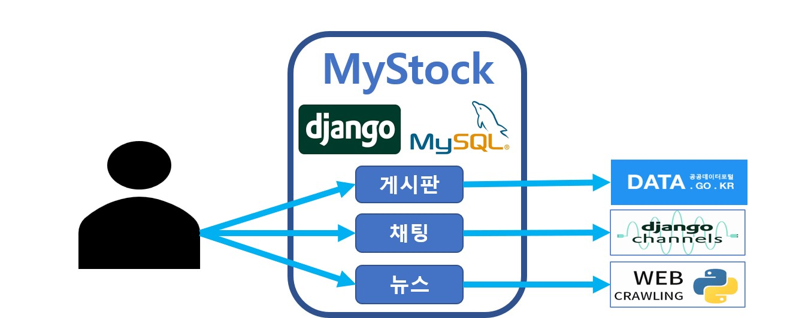
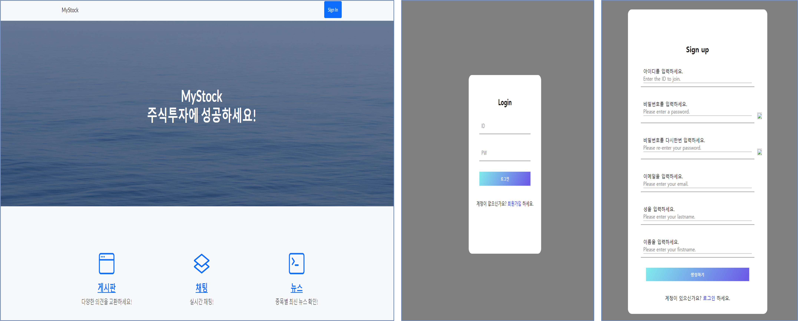
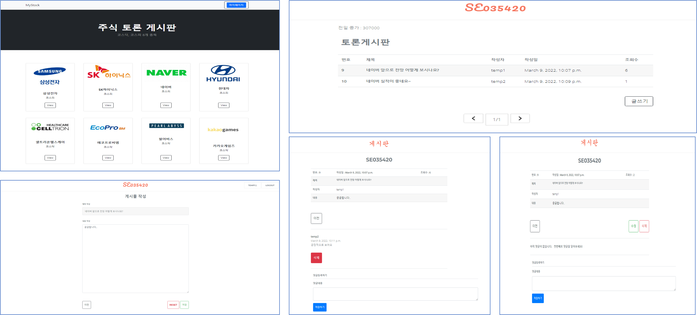
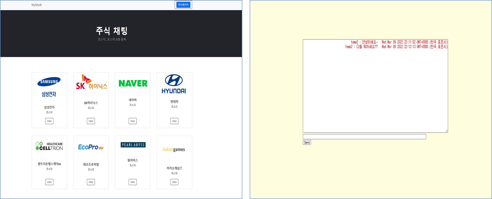
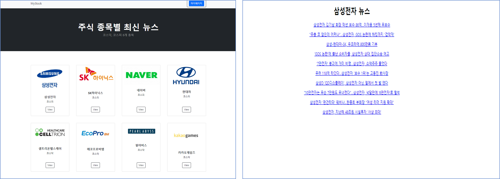

# MYSTOCK

Role: Back-end Dev, Django, Front-end Dev, MySQL
소요시간: 2022.01 ~ 2022.02

---

# 주제

---

# 기능

- **로그인/회원가입**

- **주식종목 토론 게시판**

- **주식종목 채팅**

- **주식종목 최신 뉴스**

---

# 개발환경 및 사용언어, 기술

- 개발환경 : Pycharm Professional
- 개발언어 : HTML5, CSS3, JavaScript, python
- DB : MySQL(14.14)
- 웹 프레임워크 : Django
- 통신 : python channels
- 기타 기술 : Open API, 웹 크롤링